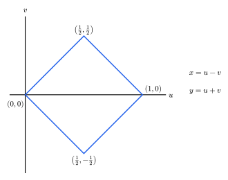

The [Basel problem](https://en.wikipedia.org/wiki/Basel_problem) asks for the solution to the infinite series of the reciprocal squares:

$$
\sum_{n=1}^\infty \frac 1 {n^2} = \, ?
$$

As [many other things](https://en.wikipedia.org/wiki/List_of_topics_named_after_Leonhard_Euler) in mathematics, it was first solved by Euler, who found that the solution was, incredibly, the transcendental value:

$$
\frac{\pi^2}{6}
$$

If you read through the linked Wikipedia page, you'll see many (quite beautiful) proofs, but they tend to rely on some decently heavy mathematical machinery.

I was going through some old maths notes I made, and stumbled across an elegant proof from Tom M. Apostol[^1] that I wanted to reproduce here.

Start by rewriting the sum so each term can be expressed as a product of two simple integrals:

$$
\begin{aligned}
\sum_{n=1}^{\infty} \frac{1}{n^2}
&= \sum_{n=0}^{\infty} \frac{1}{(n+1)^2}
&&\text{(reindexing)} \\
&= \sum_{n=0}^{\infty} \left[\frac{x^{n+1}}{n+1}\right]_0^1\left[\frac{y^{n+1}}{n+1}\right]_0^1 \\
&= \sum_{n=0}^{\infty} \left(\int_0^1 x^n \, \mathrm{d}x\right)\left(\int_0^1 y^n \, \mathrm{d}y\right) \\
&= \sum_{n=0}^{\infty} \int_0^1 \int_0^1 (xy)^n \, \mathrm{d}x \, \mathrm{d}y  && \text{(Fubini)} \\
&= \iint_{[0,1]^2} \sum_{n=0}^{\infty} (xy)^n \, \mathrm{d}A_{x,y} && \text{(Fubini)} \\
&= \iint_{[0,1]^2} \frac{1}{1-xy} \, \mathrm{d}A_{x,y}
&&\text{(geometric sum)}
\end{aligned}
$$

Where we interchange the series and the integrals by Fubini's theorem, since $(xy)^n \ge 0$ on $[0,1]^2$.

Now use the linear change of variables $x=u-v$, $y=u+v$:

<figure>
  
  <figcaption>Image of $[0,1]^2$ under the map $x=u-v$, $y=u+v$ in $(u,v)$-coordinates.</figcaption>
</figure>

The Jacobian determinant has absolute value $2$, and the square maps to a diamond-shaped region $\Delta$.

$$
\begin{aligned}
\sum_{n=1}^{\infty} \frac{1}{n^2}
&= \iint_{\Delta} \frac{1}{1-(u-v)(u+v)}\left|\frac{\partial(x,y)}{\partial(u,v)}\right| \, \mathrm{d}u \, \mathrm{d}v \\
&= \iint_{\Delta} \frac{1}{1-u^2+v^2}
\left|\begin{matrix}1 & -1 \\ 1 & 1\end{matrix}\right| \, \mathrm{d}u \, \mathrm{d}v \\
&= 2\iint_{\Delta} \frac{1}{1-u^2+v^2} \, \mathrm{d}u \, \mathrm{d}v \\
&= 2\int_0^{1/2} \int_{-u}^{u} \frac{1}{1-u^2+v^2} \, \mathrm{d}v \, \mathrm{d}u \\
&\quad + 2\int_{1/2}^{1} \int_{u-1}^{1-u} \frac{1}{1-u^2+v^2} \, \mathrm{d}v \, \mathrm{d}u.
\end{aligned}
$$

By symmetry in $v$, fold each inner integral to the positive side:

$$
\begin{aligned}
\sum_{n=1}^{\infty} \frac{1}{n^2}
&= 4\int_0^{1/2} \int_0^{u} \frac{1}{1-u^2+v^2} \, \mathrm{d}v \, \mathrm{d}u \\
&\quad + 4\int_{1/2}^{1} \int_0^{1-u} \frac{1}{1-u^2+v^2} \, \mathrm{d}v \, \mathrm{d}u \\
&= 4\int_0^{1/2} \frac{1}{\sqrt{1-u^2}} \arctan\!\left(\frac{u}{\sqrt{1-u^2}}\right) \, \mathrm{d}u \\
&\quad + 4\int_{1/2}^{1} \frac{1}{\sqrt{1-u^2}} \arctan\!\left(\frac{1-u}{\sqrt{1-u^2}}\right) \, \mathrm{d}u.
\end{aligned}
$$

We can evaluate these integrals with a trigonometric substitution:

$$
\begin{aligned}
4\int_0^{1/2} \frac{1}{\sqrt{1-u^2}} \arctan\!\left(\frac{u}{\sqrt{1-u^2}}\right) \, \mathrm{d}u
&= 4\int_0^{\pi/6} \frac{1}{\cos\theta}
\arctan\!\left(\frac{\sin\theta}{\cos\theta}\right)
\cos\theta \, \mathrm{d}\theta \\
&\text{where } u=\sin\theta,\; \mathrm{d}u=\cos\theta\,\mathrm{d}\theta \\
&= 4\int_0^{\pi/6} \arctan(\tan\theta) \, \mathrm{d}\theta \\
&= 4\int_0^{\pi/6} \theta \, \mathrm{d}\theta.
\end{aligned}
$$

and 

$$
\begin{aligned}
4\int_{1/2}^{1} \frac{1}{\sqrt{1-u^2}} \arctan\!\left(\frac{1-u}{\sqrt{1-u^2}}\right) \, \mathrm{d}u
&= 8\int_0^{\pi/6} \frac{1}{\sin(2\theta)}
\arctan\!\left(\frac{1-\cos(2\theta)}{\sin(2\theta)}\right)
\sin(2\theta) \, \mathrm{d}\theta \\
&\text{where } u=\cos(2\theta),\; \mathrm{d}u=-2\sin(2\theta)\,\mathrm{d}\theta \\
&= 8\int_0^{\pi/6} \arctan\!\left(\frac{2\sin^2\theta}{2\sin\theta\cos\theta}\right) \, \mathrm{d}\theta \\
&= 8\int_0^{\pi/6} \arctan(\tan\theta) \, \mathrm{d}\theta \\
&= 8\int_0^{\pi/6} \theta \, \mathrm{d}\theta.
\end{aligned}
$$

Finally, putting both pieces together gives:

$$
\begin{aligned}
\sum_{n=1}^{\infty} \frac{1}{n^2}
&= 12\int_0^{\pi/6} \theta \, \mathrm{d}\theta = 12\left[\frac{\theta^2}{2}\right]_0^{\pi/6}\\
&= \boxed{\frac{\pi^2}{6}}
\end{aligned}
$$

**Note**: I can't actually access the original text (paywalled, alas), so I hope this is faithful to Apostol's derivation. I'm not sure where I came across this argument initially, but I suspect it was in my Vector Calculus class.

[^1]: Tom M. Apostol, "A Proof that Euler Missed: Evaluating $\zeta(2)$ the Easy Way", *The Mathematical Intelligencer* (1983). DOI: [https://doi.org/10.1007/BF03026576](https://doi.org/10.1007/BF03026576).
